# LOGO程序作品集

这是我小学时学习LOGO编程语言的一些作品，是我写过的最早的代码。

这些程序创作于2006-2008年，也就是我三四年级的时候。

当时是在WinXP下用`PC Logo 4.0` 编辑的，这个程序目前在64位系统下无法运行。

于是我找了几个LOGO的在线解释器，如 [papert](http://logo.twentygototen.org) 和 [jslogo](http://calormen.com/jslogo/) ，重新运行了几个程序，截图保存下来。可惜的是有些程序中的指令它们并不支持，无法运行。

看到自己当时写的程序还是挺感慨的。虽然不是正经的编程语言，但编程的各方面基础知识都涉及到了，甚至还拿它开始写起了GUI。我是挺佩服自己的。

特别感谢当时的信息技术课苏曙光老师，给予我大力支持。

感谢LOGO语言的发明者和普及者。

## 画廊

<figure class="third">
    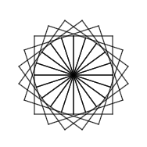
    
    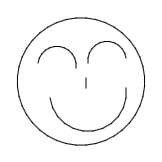
</figure>
<figure class="third">
    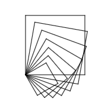
    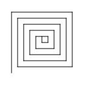
    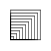
</figure>
<figure class="third">
    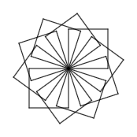
    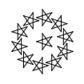
    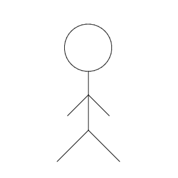
</figure>
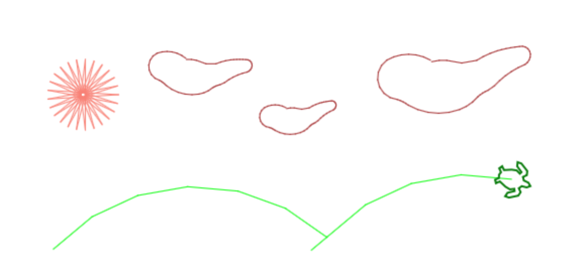

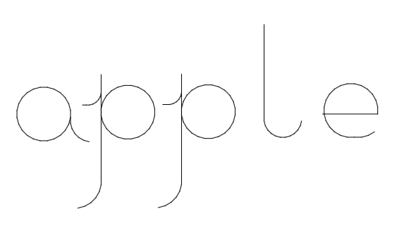
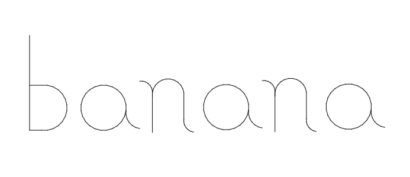
<figure class="half">
    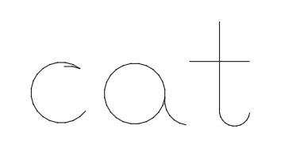
    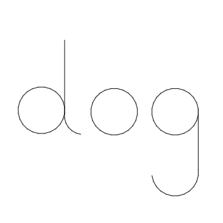
</figure>

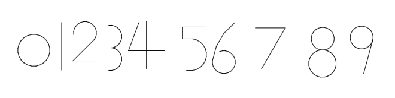
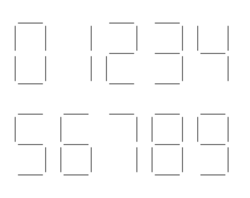

<figure class="third">
    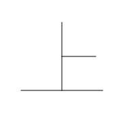
    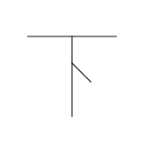
    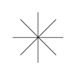
</figure>
<figure class="third">
    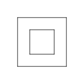
    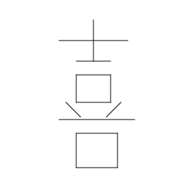
    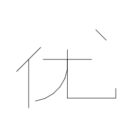
</figure>

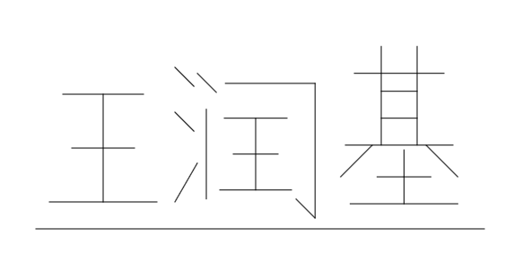
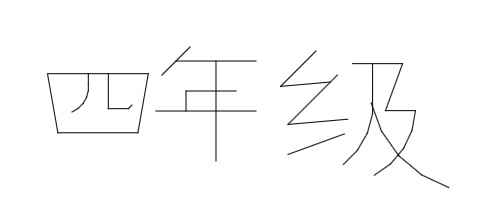
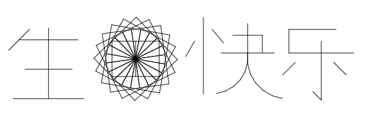
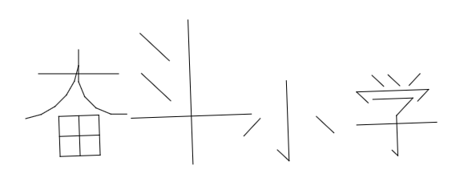
